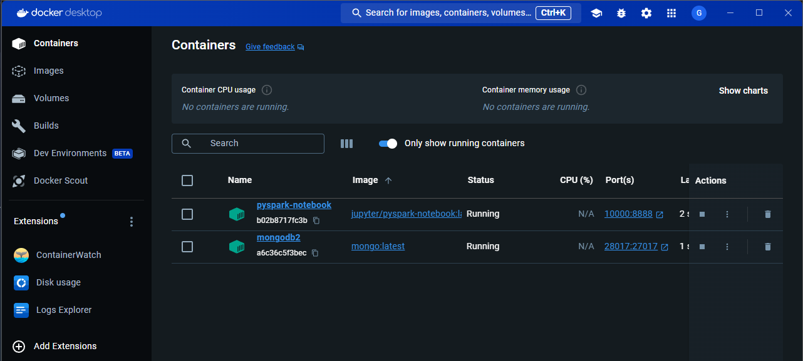
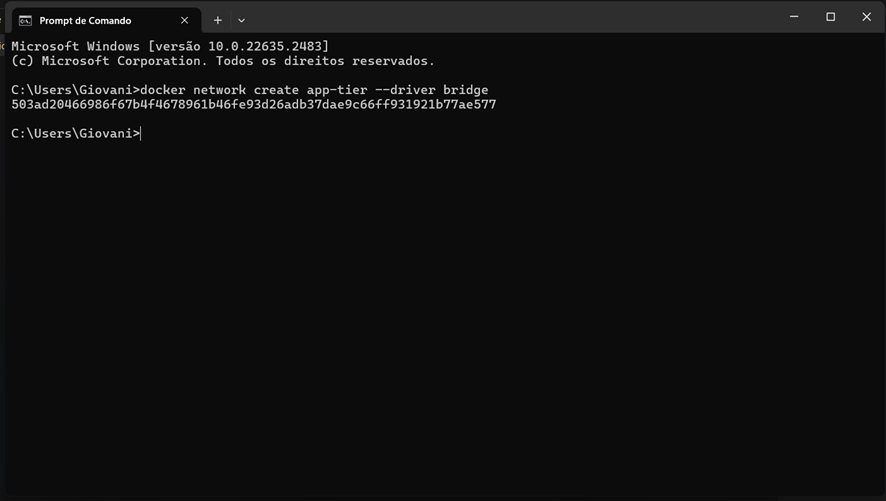
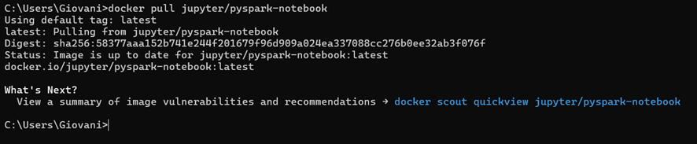
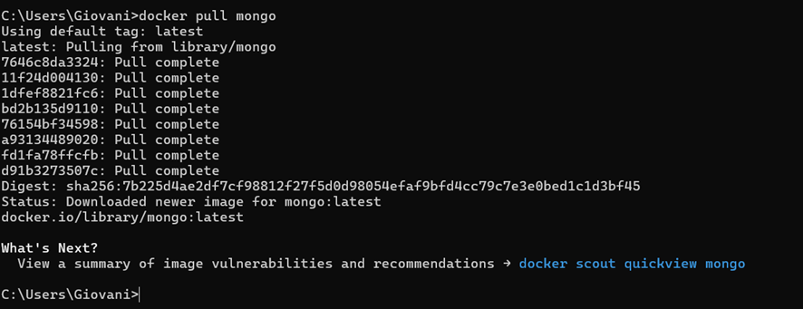
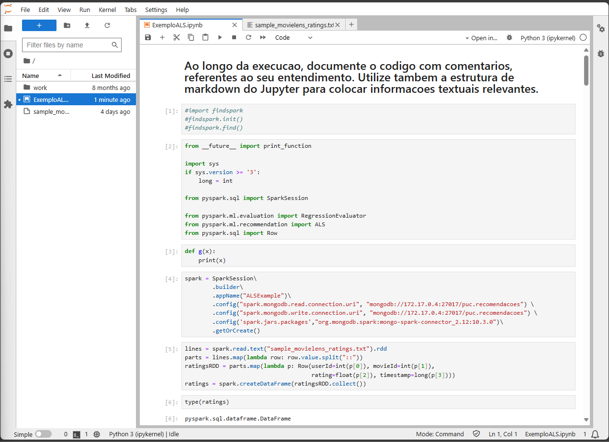

# Sistema de Recomendação em Tempo Real com Apache Spark e MongoDB

## 🚀 1 - Introdução 

O projeto foca na geração de recomendações usando o modelo ALS (Alternating Least Squares) da MLlib do Apache Spark. As recomendações serão armazenadas localmente no MongoDB. Uma API será desenvolvida com FastAPI. Além disso, uma aplicação Spark Streaming se conectará a um tópico Kafka para fornecer recomendações em tempo real.


## ⚙️ 2 - Hardware e aplicativos utilizados

Apache Spark: Plataforma de processamento de dados em grande escala.
MLlib: Biblioteca de aprendizado de máquina do Spark.
MongoDB: Banco de dados NoSQL.
FastAPI: Framework para construção de APIs em Python.
Docker: Ferramenta para criação e gerenciamento de containers.
                            
## 📖 3 - Requisitos do Projeto 

1 - Implementar um sistema de recomendação utilizando o modelo ALS do Spark MLlib.
2 - Armazenar as recomendações no MongoDB.
3 - Criar uma API utilizando FastAPI para fornecer recomendações baseadas nas preferencias do usuário.

## 📝4 - Procedimentos e resultados


Configuração do Ambiente:

Vamos utilizar o Docker com as imagens do MongoDB e do Jupyter Notebook.



Como tenho alguns containers de MongoDB instalados, mudei a porta para a 28017 para evitar conflitos.


Vamos criar uma rede para isso, execute no prompt de comando o seguinte comando

```
docker network create app-tier --driver bridge
```



depois instale o Jupyter

```
docker pull jupyter/pyspark-notebook
```


depois instale o MongoDB

```
docker pull mongo
```



uma vez que o container com o Jypiter e o Mongo estão rodando, vamos acessar o o jupiter e executar o Script ExemploALS.ipynb



o script acima faz o seguinte:


### Importação de Bibliotecas
Nesta célula, são importadas as bibliotecas necessárias para a criação do sistema de recomendação. Também há uma verificação da versão do Python para garantir compatibilidade com a função long.


#### Configuração da Sessão Spark
Cria uma sessão do Spark e configura a conexão com um banco de dados MongoDB.

#### Leitura e Processamento dos Dados
Lê um arquivo de texto com avaliações de filmes e transforma essas avaliações em um DataFrame do Spark.

#### Divisão dos Dados
Divide os dados em conjuntos de treinamento e teste, sendo 80% e 20% respectivamente.

#### Treinamento do Modelo
Configura e treina um modelo de recomendação ALS (Alternating Least Squares) usando o conjunto de treinamento.

#### Avaliação do Modelo
Transforma os dados de teste com o modelo treinado e avalia a precisão do modelo usando o RMSE (Root Mean Square Error).

#### Recomendação para Usuários
Gera recomendações de filmes para todos os usuários e exibe as primeiras 10 recomendações.

#### Recomendação para Itens (Filmes)
Gera recomendações de usuários para todos os filmes e exibe as primeiras 20 recomendações.

#### Seleção de Recomendação por IDs de Filmes
Seleciona apenas os IDs dos filmes recomendados para os usuários.

#### Salvando as Recomendações no MongoDB
Salva as recomendações geradas no MongoDB.


## 📋5 - Conclusão

A execução deste projeto permitiu a implementação de um sistema de recomendação robusto utilizando diversas tecnologias de big data e aprendizado de máquina. O uso do modelo ALS do Spark MLlib proporcionou recomendações eficazes, e o armazenamento no MongoDB garantiu uma recuperação rápida dos dados. A API desenvolvida com FastAPI facilitou o acesso às recomendações, enquanto a integração com Kafka e Spark Streaming permitiu o fornecimento de recomendações em tempo real.