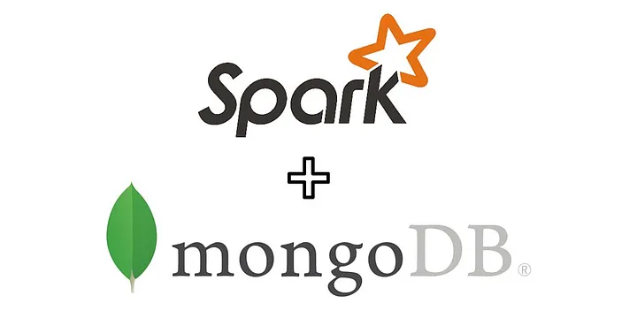

# Sistema de Recomendação em Tempo Real com Apache Spark e MongoDB

## 🚀 1 - Introdução 

O tema deste projeto é a geração de recomendações utilizando a biblioteca MLlib do Apache Spark, com ênfase no modelo ALS (Alternating Least Squares). As recomendações geradas serão armazenadas em um banco de dados MongoDB, executado localmente. Para facilitar o acesso às recomendações, será desenvolvida uma API utilizando a biblioteca FastAPI. Adicionalmente, será implementada uma aplicação Spark Streaming que se conecta a um tópico Kafka para fornecer recomendações em tempo real.

## ⚙️ 2 - Hardware e aplicativos utilizados

Apache Spark: Plataforma de processamento de dados em grande escala.
MLlib: Biblioteca de aprendizado de máquina do Spark.
MongoDB: Banco de dados NoSQL.
FastAPI: Framework para construção de APIs em Python.
Kafka: Plataforma de streaming de eventos.
Docker: Ferramenta para criação e gerenciamento de containers.
                            
## 📖 3 - Requisitos do Projeto 

1 - Implementar um sistema de recomendação utilizando o modelo ALS do Spark MLlib.
2 - Armazenar as recomendações no MongoDB para acesso eficiente.
3 - Criar uma API utilizando FastAPI para fornecer recomendações baseadas no ID do usuário.
4 - Desenvolver uma aplicação Spark Streaming para conectar-se a um tópico Kafka e fornecer recomendações em tempo real.

## 📝4 - Procedimentos e resultados

Configuração do Ambiente:

Configuração do Apache Spark e instalação das bibliotecas necessárias.
Configuração do MongoDB localmente e inserção de dados de teste.
Configuração do Kafka para criação e gerenciamento de tópicos.
Utilização de Docker para isolar e gerenciar os diferentes componentes do projeto.
Desenvolvimento do Modelo de Recomendação:

Criação do modelo de recomendação utilizando o algoritmo ALS.
Treinamento do modelo com dados de exemplo.
Geração de recomendações e armazenamento no MongoDB.
Desenvolvimento da API com FastAPI:

Implementação da API para consultas de recomendações baseadas no ID do usuário.
Testes de endpoints da API utilizando ferramentas como Postman.
Implementação do Spark Streaming com Kafka:

Desenvolvimento de uma aplicação Spark que se conecta a um tópico Kafka para receber mensagens com o ID do usuário.
Consulta das recomendações no MongoDB utilizando Mongo Spark Connector.
Envio das recomendações para um tópico Kafka definido.

## 📋5 - Conclusão

A execução deste projeto permitiu a implementação de um sistema de recomendação robusto utilizando diversas tecnologias de big data e aprendizado de máquina. O uso do modelo ALS do Spark MLlib proporcionou recomendações eficazes, e o armazenamento no MongoDB garantiu uma recuperação rápida dos dados. A API desenvolvida com FastAPI facilitou o acesso às recomendações, enquanto a integração com Kafka e Spark Streaming permitiu o fornecimento de recomendações em tempo real.